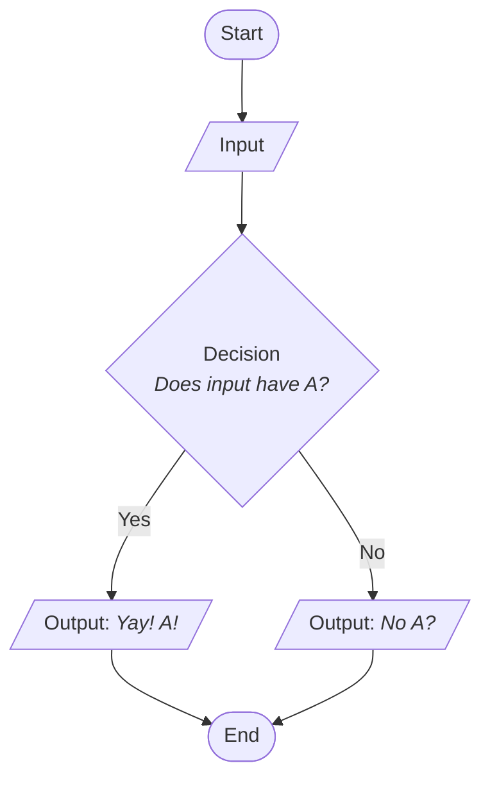

# C1.3 - Program Design

## Waterfall Software Development Life Cycle

1. **analysis:** figure out exactly what the program must accomplish
2. **design:** produce a ***requirements specification*** and ***design document*** that describes exactly what a program will do
   1. most important part of cycle
3. **implementation:** programmer translates each part of the ***design document*** into code
4. **testing:** check the program in different ways to make sure that it meets user requirements and has no error in logic
5. **maintenance:** program released; program contains bugs and they must be fixed over time

Model designed to flow in one direction, hard to go the other way

- 60% errors due to incorrect analysis
- 30% incorrect design
- 10% logic errors in code

## Algorithms and Pseudocode

**algorithm:** series of actions performed in a specific order to produce a desired result

**pseudocode:** fake code that helps programmers understand the logic of their code &mdash; no need to worry about syntax errors

## Flowchart

**flowchart:** diagram that visually shows the steps that take place in a program

- ovals represent start and end of program
- parallelograms represent input/output
- rectangles represent processes on data
- diamonds represent decision-making ops.
- arrows represent flow between ops.

## Input, Processing, Output (IPO) Model

1. **I**nput some data
2. **P**rocess the data
3. **O**utput some result