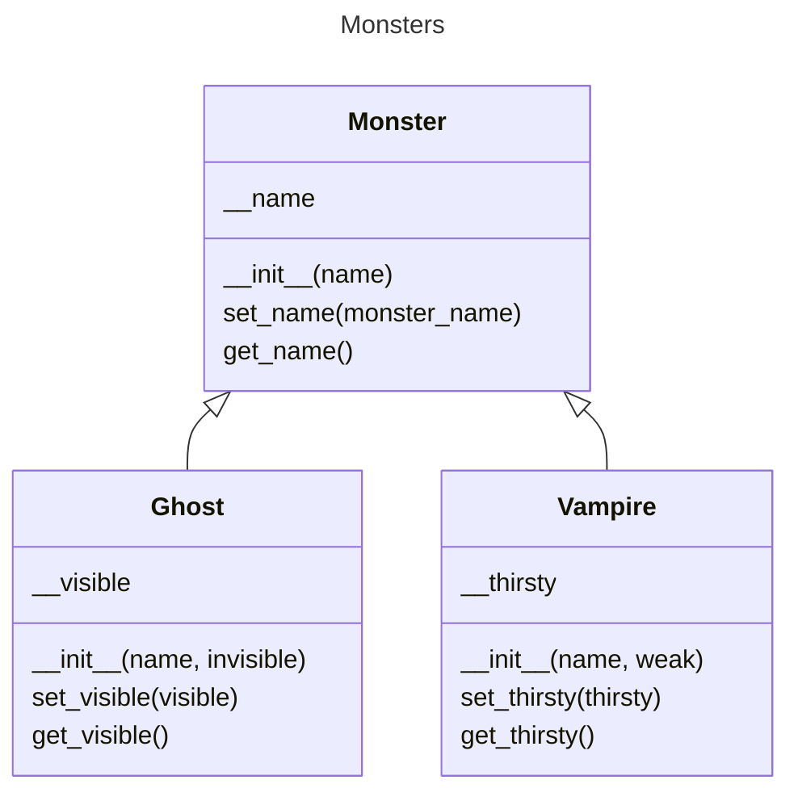

# C2.3 - Inheritance

## Inheritance

- **inheritance:** the concept of a class inheriting properties from another class
- **superclass / base / parent class:** a class where other class inherits from
- **subclass / derived / child class:** a specialized class derived from the superclass

### Benefits

- Allows similar classes to have similar properties
- But allows each class to have its own unique properties
- ✔ Less code written to accomplish the same task

## How to Create Inherited Class

*General format:*

```py
class Name_of_Subclass(Name_of_Superclass):
	def __init__(self, params):
		Name_of_Superclass.__init__(self, superclass_attributes)
		self.subclass_attribute_1 = subclass_param_1
		self.subclass_attribute_2 = subclass_param_2
		...
```

The first line of `__init__` can also be replaced with

```py
super().__init__(superclass_attributes)
```

### ⚠ BEWARE: Location of Superclass

When creating a child class, parent class MUST be in same file and BEFORE the child class

If parent class not in same file, import file, then use dot notation: `module_name.Name_of_Superclass`

## Properties of Inherited Classes

1. They have the same methods and attributes as the superclass
2. They add on to the superclass by adding new attributes or methods
3. The original attributes or methods can be accessed, even if they weren't explicitly defined

## Example: Creating Different Monsters for Halloween

```py
"""The parent monster class"""

class Monster:
	def __init__(self, name):
		self.__name = ""
		self.set_name(name)
	
	def set_name(self, name):
		if name and type(name) == str:
			self.__name = name
		else:
			self.__name = "Unknown"
			
	def get_name(self):
		return self.__name
	
	def speak(self):
		print("MUAHAHAHAHA! I am the most fearful", self.__name + "!")

"""The inherited monster classes"""

class Ghost(Monster):
	def __init__(self, name, invisible=True):
		Monster.__init__(self, name)
		self.__visible = not invisible
	
	def set_visible(self, visible):
		if type(visible) == bool:
			self.__visible = visible
	
	def get_visible(self):
		return self.__visible

class Vampire(Monster):
	def __init__(self, name, weak = True):
		super().__init__(name)
		self.__thirsty = weak if type(weak) == bool else True
	
	def set_thirsty(self, thirsty):
		if type(thirsty) == bool:
			self.__thirsty = thirsty
	
	def get_thirsty(self):
		return self.__thirsty

"""Test the inherited classes"""

if __name__ == "__main__":
	# Ghost
	casper = Ghost("Casper", False)
	casper.speak()
	print("Visible" if casper.get_visible() else "Invisible")
	casper.set_visible(False)
	print("Visible" if casper.get_visible() else "Invisible")
	# Vampire
	dracula = Vampire("Dracula")
	dracula.speak()
	dracula.set_thirsty(False)	
	print("" if dracula.get_thirsty() else "Not", "Thirsty")
```

Click *Run* to see results

*Ghost* has inherited all properties from *Monster* and added new properties

## ⚠ Using Encapsulation with Inheritance

> The parent's private attributes are **NOT** accessible to the child class.
>
> You must use getter and setter methods from the superclass.

## Overriding Methods from Parent

Create a new method with the same method as the parent

```py
"""The parent monster class"""

class Monster:
	def __init__(self, name):
		self.__name = ""
		self.set_name(name)
	
	def set_name(self, name):
		if name and type(name) == str:
			self.__name = name
		else:
			self.__name = "Unknown"
			
	def get_name(self):
		return self.__name
	
	def speak(self):
		print("MUAHAHAHAHA! I am the most fearful", self.__name + "!")

"""The inherited monster classes"""

class Ghost(Monster):
	def __init__(self, name, invisible=True):
		Monster.__init__(self, name)
		self.__visible = not invisible
	
	def set_visible(self, visible):
		if type(visible) == bool:
			self.__visible = visible
	
	def get_visible(self):
		return self.__visible
	
	"""Overriding method"""
	
	def speak(self):
		print("BOOOOO! I am the most fearful", self.get_name() + "!")

"""Test the inherited classes"""

if __name__ == "__main__":
	casper = Ghost("Casper")
	casper.speak()
```

## UML Diagrams

- **UML diagram:** a programmer's way of representing data in an ordered fashion
- **UML class diagram:** a diagram that shows the relationship between classes, represented as boxes
	- first row is the class name
	- second row are the attributes
	- third row are the methods

Example UML Diagram for the **Monsters**



The arrows should branch like this though:

```
	   ^
	   |
	   |
---------------
|             |
^             ^
|             |
```