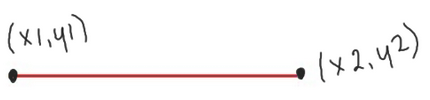
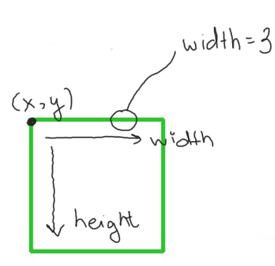
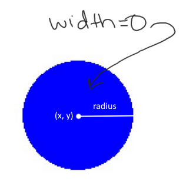
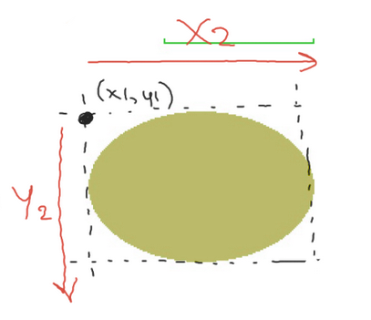
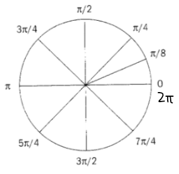
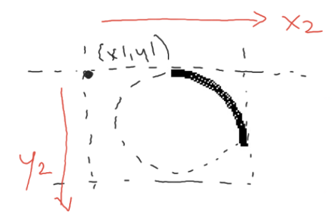
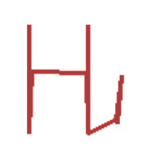
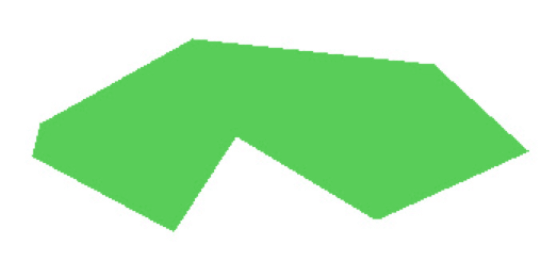

# C3.2 - Pygame Drawing

## Drawing Shapes

`pygame.draw`: module that allows you to draw shapes on to a surface

*NOTE:* `(r, g, b)` can be replaced by string with color name or hex code

### Functions

- `line(Surface, (r, g, b), (x1, y1), (x2, y2), width=1)`
	- Draws a line on given `Surface`
	- Colour given via `(r, g, b)`
	- Line drawn from `(x1, y1)` to `(x2, y2)`
	- Width of line given by `width`



- `rect(Surface, (r, g, b), ((x, y), (width, height)), width=0)`
	- Draws a rectangle on given `Surface`
	- Colour: `(r, g, b)`
	- Upper-left corner of rectangle at `(x, y)`
	- Width and height of rect. from `(width, height)`
	- Final `width` parameter specifies line thickness
		- `width=0` causes rect. to be filled in



- `circle(Surface, (r, g, b), (x, y), radius, width=0)`
	- Draws circle on given `Surface`
	- Colour: `(r, g, b)`
	- Center of circle: `(x, y)`
	- Radius: `radius` px
	- `width` = line thickness
		- 0 width = filled in



- `ellipse(Surface, (r, g, b), ((x1, y1), (x2, y2)), width=0)`
	- Ellipse = oval shape
	- Draws ellipse on `Surface`
	- Colour: `(r, g, b)`
	- Params `((x1, y1), ((x2, y2))` create a bounding rectangle with
		- U-L corn. `(x1, y1)`
		- width `x2`
		- height `y2`
	- `width` = line thickness
		- 0 width = filled in



- `arc(Surface, (r, g, b), ((x1, y1), (x2, y2)), start_angle, end_angle, width=1)`
	- Section of ellipse
	- Draws arc on `Surface` w/ `(r,g,b)` colour
	- `((x1, y1), (x2, y2)` creates bounding rectangle *(same as ellipse)*
	- `start_angle`: angle where arc should start (in radians)
	- `end_angle`: angle where arc should end (in radians)
	- `width` defines line thickness
	- use `math.pi` constant

*Radian Unit Circle*



*Arc specs*


 
 - `lines(Surface, (r, g, b), closed, points, width=1)`
	 - Draws a series of connected lines on `Surface`
	 - colour: `(r, g, b)`
	 - `points`: a list / tuple of `(x, y)` coords. of vertex points
	 - if `closed = True`, pygame treats the first and last point as connected
		 - creates a filled in polygon
	- `width` = line thickness



- `polygon(Surface, (r, g, b), points, width=0)`
	- Draws a closed polygon on `Surface`
	- colour: `(r, g, b)`
	- `points`: a list / tuple of vertex points
	- automatically connects lines together to create closed shape
	- `width` = line thickness
		- 0 width = filled in



### Detecting Location of Mouse Click

- Event: `pygame.MOUSEBUTTONUP`
	- when user releases mouse button
- Alternative Event: `pygame.MOUSEBUTTONDOWN`
	- when user first presses down mouse btn.
- `pygame.mouse.get_pos()` returns `(x, y)` coordinates of cursor

```py
for event in pygame.event.get():
	if event.type == pygame.QUIT:
		keepGoing = False
	elif event.type == pygame.MOUSEBUTTONUP:
		print(pygame.mouse.get_pos())
```