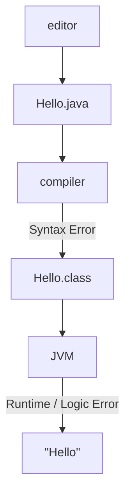
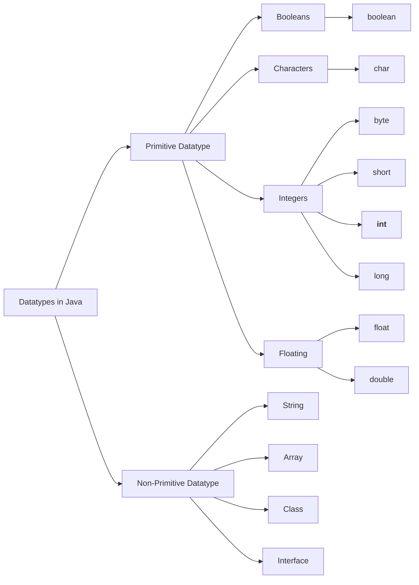
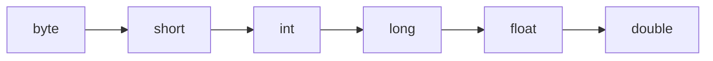
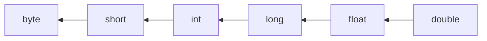

# C4.1 - Basics of Java

## Errors and Java Compilation

- **syntax error:** error in programming grammar; detected by compiler
- **runtime error:** unexpected crash of program bcz. some invalid command was executed while program was running
- **logic error:** mistake that does not cause a crash, but doesn't produce desired result



## Simple Programs

- Programs begin in a class w/ same name as file name
- Single line comments begin with: `//`
- Multi-line comments are wrapped w/ `/*` and `*/`
- Classes and methods are wrapped in curly braces
- All statements end with `;`

### Ex. 1: Hello World

- `System.out.println(data)`: print a new line outputting `data`
- `System.out.print(data)`: print `data` w/o printing new line

```java
// class name: Hello

/*
filename: Hello.java
outputs: Hello World!
*/

class Hello {
	public static void main(String[] args) {
		System.out.println("Hello World!")
	} // end main()
} // end Hello class
```

### Ex. 2: Formatted Output

- `System.out.printf(string, var1, var2, ...)`: prints a formatted `string` containing variables passed into `var1` and onward
	- `%s` &mdash; strings 
	- `%d` &mdash; integers
	- `%f` &mdash; floating-point numbers
- Escape characters
	- `\t` &mdash; tab
	- `\n` &mdash; newline
	- `\"` &mdash; double quote
	- `\'` &mdash; single quote
- Concatenation with `+`

```java
class Main {
	public static void main(String[] args) {
		String fname = "Adore";
		String lname = "S.";
		int age = 17;
		float height = 180.5f; // f indicates float type
		System.out.print("Hello...\n");
		System.out.println(fname + " " + lname);
		System.out.printf("%s is %d years old and is %f m tall", fname, age, height);
	}
}

/*
Output:

Hello...

Adore S.
Adore is 17 years old and is 180.5 m tall
*/
```

## Declaring Variables and Data Types

**Syntax:** `<data type> <variable name>;`

i.e. `double value = 23.45435;`

- **primitive datatypes:** datatype that directly stores a value
	- starts w/ lowercase letter
	- types
		- `int`
		- `float`
		- `double`
		- `boolean`
		- etc.
- **non-primitive data types:** objects that store values
	- often comes w/ package of methods
	- default value: `null`
	- starts w/ uppercase letter
	- types
		- `String`
		- `Array`
		- `Interface`
		- etc.
- datatypes need to be specified when declaring variable

*Python:*

```py
a = 20
b = "str"
c = 20.15
```

*Java:*

```java
int a;
a = 20;

String b = "str";
double c = 20.15;
```

*Datatype flowchart:*



## Math Operators and Methods

- `+ - / *` used for basic arithmetic
	- `+=, -=, /=, *=` remain valid shorthands (i.e. `x += 2` means `x = x + 2`)
	- `++` is a shortcut for `... += 1`
	- `--` is a shortcut for `... -= 1`
- `Math.round(num * place) / place` is used to round numbers to the nearest `1/place`th

*Rounding num. ex.*

```java
public class Rounding {
	public static void main(String[] args) {
		double num = 54.565;
		// round to 2 decimals
		double ans1 = Math.round(num * 100.0) / 100.0;
		// round to 1 decimal
		double ans2 = Math.round(num * 10.0) / 10.0;
		// round to whole
		double ans3 = Math.round(num);
		// output answers
		System.out.printf("1: %f\n2: %f\n3: %f", ans1, ans2, ans3);
	}
}

/*
Output:

1: 54.57
2: 54.6
3: 55.0
*/
```

## Automatic Type Conversion

**Widening (implicit):**



**Narrowing (explicit), requires casting**



### Type casting

Syntax: `(type) value`

i.e. Convert float `a` into int, then store in `b`

```java
float a = 7.0;
int b = (int) a;
```

## User Input

- must `import java.util.Scanner;`
- create new `Scanner` object using `new` keyword
	- `Scanner input = new Scanner(System.in);`
- get input by using:
	- `input.nextLine();` &mdash; string
	- `input.nextInt();` &mdash; integer
	- `input.nextFloat()` &mdash; float
	- `input.nextDouble()` &mdash; double

*Example:*

```java
// import Scanner object
import java.util.Scanner; 

public class UserInput1 {
   public static void main(String[] args) {
       // Open a Scanner object to get keyboard input
       Scanner input = new Scanner( System.in );
      
       int age;
       String name;      
       System.out.print( "What is your full name: " );
       name = input.nextLine(); // reads in a String
       System.out.print( "How old are you: " );
       age = input.nextInt(); // reads in an integer
      
       System.out.print( "Well, " + name);
       System.out.println( ", you are " + age + " years old." );
	  input.close();// close Scanner object
    }  
}
```

### Reading Number Before String

```java
System.out.print("How old are you: " );
age = input.nextInt(); // reads in an integer
System.out.print("What is your full name: " );
name = input.nextLine(); // reads in a String
System.out.print("Well, " + name);
System.out.println(", you are " + age + " years old." );

/*
Output:
How old are you: 17
What is your full name: Well, , you are 17 years old.
*/
```

**Reason for Occurrence:**

- `nextInt()` (or the one for float / double) only reads digits, but doesn't remove user-typed newline
- `nextLine()` then reads `\n` and assumes user has already pressed enter

#### Fix 1: Catch New Line

```java
System.out.print("How old are you: " );
age = input.nextInt();

input.nextLine(); // <-- FIX!!!!

System.out.print("What is your full name: " );
name = input.nextLine();

System.out.print("Well, " + name);
System.out.println(", you are " + age + " years old." );
```

#### Fix 2: Convert to Number

```java
int age;
String name, ageString;

System.out.print( "How old are you: " );
ageString = input.nextLine(); // reads in as a String
age = Integer.parseInt(ageString); //<-- FIX!! || Convert String to int
       
System.out.print( "What is your full name: " );
name = input.nextLine(); // reads in a String
      
System.out.print( "Well, " + name);
System.out.println( ", you are " + age + " years old." );
```

|Conversion|Method|
|-|-|
|String &rarr; int|`Integer.parseInt(str)`|
|String &rarr; long|`Long.parseLong(str)`|
|String &rarr; float|`Float.parseFloat(str)`|
|String &rarr; double|`Double.parseDouble(str)`|