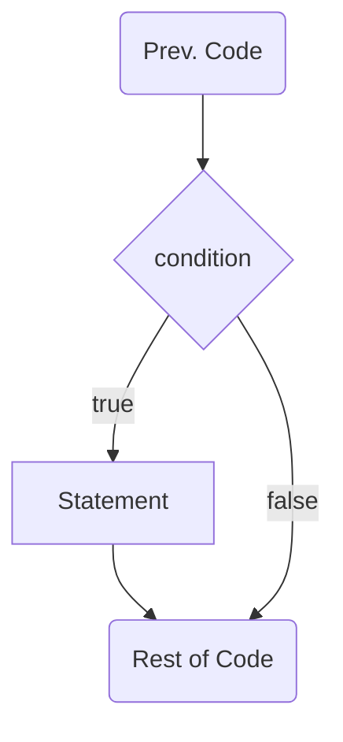
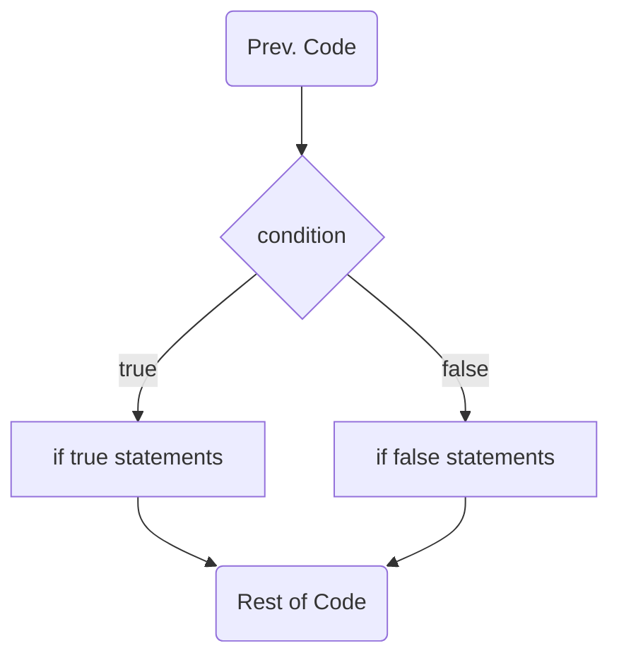
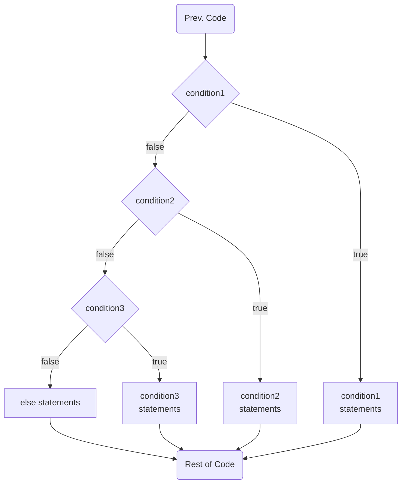
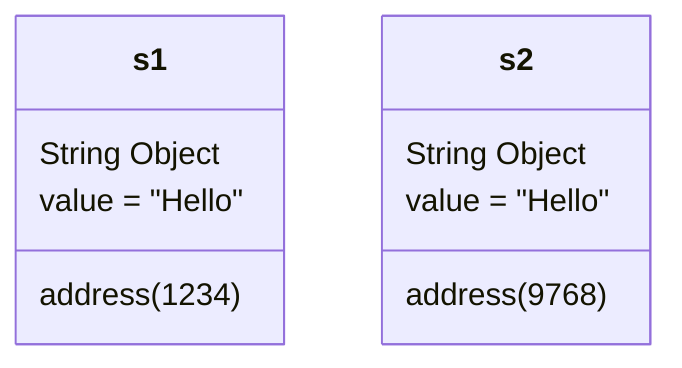
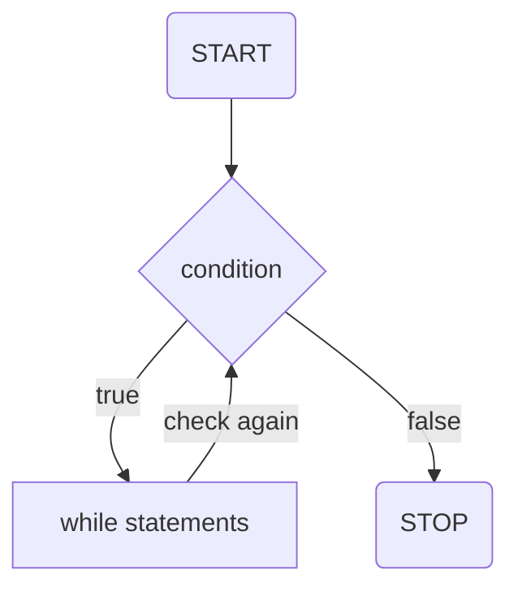
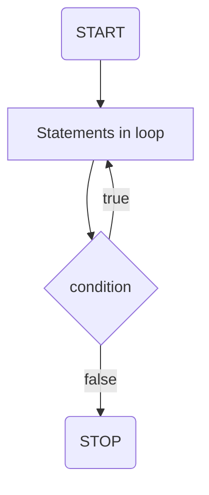
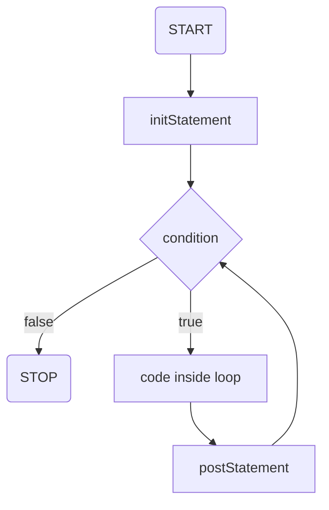

# C4.2 - Decision & Repetition Structures

## Decision Structures

### `if` Statement

**Syntax:**

```java
if (condition) {
	// block of code to be executed if condition is true
}
```

*Example:*

```java
int x = 20;
int y = 18;

if (x > y) {
	System.out.println("x is greater than y");
}
```

Logic flowchart:



*Note:* If there is only one statement in `if`, no curly braces needed!

```java
if (x > y)
	System.out.println("x is greater than y");
```

### `if-else` Statement

**Syntax:**

```java
if (condition) {
	// block of code to be executed if condition is true
} else {
	// block of code to be executed if condition is false
}
```

*Example:*

```java
int time = 20;

if (time < 18) {
	System.out.println("Good day.");
} else {
	System.out.println("Good evening.");
}

// Outputs: Good evening.
```

Logic:



### `else-if` Statement

**Syntax:**

```java
if (condition1) {
	// execute if condition1 is true
} else if (condition2) {
	// execute if condition2 is true
}
// ... as many else ifs as needed
else {
	// execute if none of the above conditions are true
}
```

*NOTE:* There can be as many `else if` statements as needed

*Example:*

```java
int time = 22;

if (time < 10) {
	System.out.println("Good morning.");
} else if (time < 20) {
	System.out.println("Good day.");
} else {
	System.out.println("Good evening.");
}

// Outputs: Good evening.
```

Logic (3 conditions, 2 `else if`, and 1 `else`):



### Comparison (Relational) Ops. for Primitive Data Types

|Relational Operator|Description|
|-|-|
|`==`|equal to|
|`!=`|not equal to|
|`>`|greater than|
|`<`|less than|
|`>=`|greater than or equal to|
|`<=`|less than or equal to|

### Comparing Strings

*Example:*

```java
String s1 = new String("Hello");
String s2 = new String("Hello");
System.out.println(s1 == s2); // prints FALSE
System.out.println(s1.equals(s2)); // prints TRUE
```

**IMPORTANT:** `==` compares the memory address of each string object, not the values



*NOTE* that `s1` and `s2` both have diff. memory addresses since they are both `new String` objects

#### Java Smarts

```java
String s1 = "Hello";
String s2 = "Hello";
System.out.println(s1 == s2); // true
```

causes Java to assign `s2` to the same `String` object as `s1`

### String Comparison Methods

`a` and `b` are two strings

|Comparison method|Description|
|-|-|
|`a.equals(b)`|a equals b? (valuewise)|
|`a.equalsIgnoreCase(b)`|while ignoring case, does a equal b?|
|`a.compareTo(b) > 0`|a comes after b alphabetically|
|`a.compareTo(b) < 0`|a comes before b alphabetically|

### Logical Operators

**OR: `||`**

Truth Table

|\|\||false|true|
|-|-|-|
|**false**|false|true|
|**true**|true|true

Sample code:

```java
int x = 50;
if (x < 0 || x > 100) {
	System.out.println("x must be between 0-100, incl.");
}
```

**AND: `&&`**

Truth Table

|&&|false|true|
|-|-|-|
|**false**|false|false|
|**true**|false|true|

Sample code:

```java
int x = 5;
if (x > 3 && x < 10)
	System.out.println("x between 3 and 10")
```

**NOT: `!`**

Truth Table

|!|false|true|
|-|-|-|
||true|false|

```java
int x = 5;
if (!(x > 3))
	System.out.println("x is <= 3");
```

## Repetition Structures

### `while` loop

**pre-test loop:** a loop that checks the condition before executing (i.e. `while`)

**Syntax:**

```java
while (condition) {
	// code block to be executed
}
```

*Example:*

```java
int i = 0;

while (i < 5) {
	System.out.println(i);
	i++;
}
```

Logic:



### Do-While Loop

**post-test loop:** a loop that executes before checking the condition to execute again (i.e. do-while)

**Syntax:**

```java
do {
	// code to be executed
} while (condition);
```

*Example:*

```java
int i = 0;
do {
	System.out.println(i);
	i++;
}
while (i < 5);
```

Logic:



### `for` Loop

**Syntax:**

```java
for (initStatement; condition; postStatement) {
	// code block executed
}
```

- `initStatement` is executed (once) before execution of code block
	- typically used to define a counter
- `condition` defines condition for executing code block
- `postStatement` is executed every time after code block has been executed
	- typically used to update the counter (increment / decrement)

*Example:*

```java
for (int i = 0; i < 5; i++)
	System.out.println(i); // curly-braces optional for 1 statement
```

Logic:



### `break` Statement

`break`  terminates execution of loop (and following statements) when it is reached

*Example:*

```java
for (int i = 0; i < 10; i++) {
	if (i == 4)
		break;
	System.out.println(i);
}

// Prints nums. from 0 -> 3
```

Above prints numbers from 0 to 3, since it breaks at 4

### `continue` Statement

- `continue` prematurely begins the next repetition of the loop when it is reached
- it can be used to "skip" an iteration

*Example:*

```java
for (int i = 0; i < 10; i++) {
	if (i == 4)
		continue;
	System.out.println(i);
}

/*
Output:

0
1
2
3
5
6
7
8
9
*/
```

