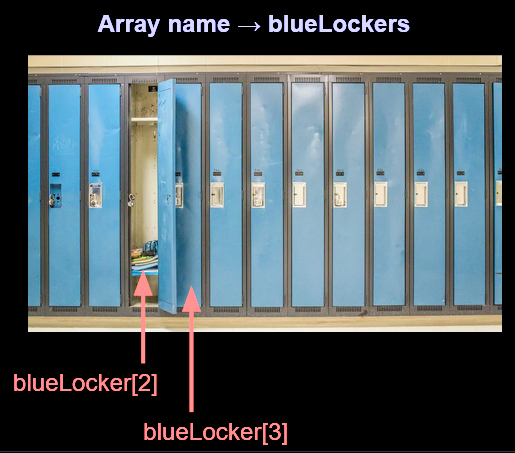
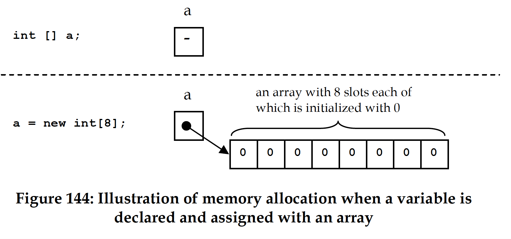
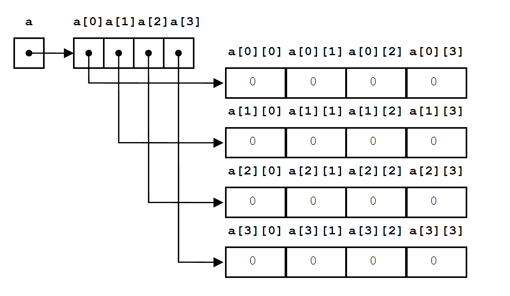

# C4.3 - Arrays

## Analogy for Array

- Lockers are like a 1D array
- Purpose is to store school stuff
	- Each locker is a slot to store something
- Lockers are accessed by a number



### Notes on Java Arrays

- Java arrays have a fixed size
- Java arrays are not dynamic
- Dynamic arrays are achieved using Java's `ArrayList`
- Java arrays can only store one datatype

## Declaring 1D array

**Method 1 (Declare and Assign)**

Syntax:

```java
<<data type>> [] <<array name>> = new <<data type>> [<<array size>>];
```

Example:

```java
String [] students = new String [10];
```

**Method 2**

Syntax:

```java
<<data type>> <<array name>> [] = new <<data type>> [<<array size>>];
```

Example:

```java
String students[] = new String [10];
```

**Method 3 (Declare, then Assign)**

Syntax:

```java
<<data type>> [] <<array name>>;
<<array name>> = new <<data type>> [<<array size>>];
```

Example:

```java
String students[];
students = new String[10];
```

**Method 4**

Syntax:

```java
<<data type>> <<array name>> [];
<<array name>> = new <<data type>> [<<array size>>];
```

Example:

```java
String[] students;
students = new String[10];
```

## 1D Array Reference

*Code:*

```java
int[] a;
a = new int[8];
```

*What is happening:*



## Array Properties

- `import java.util.Array;`
- `array.sort()` sorts `array`
- `array.length` returns length of `array`
	- no need for `import` here

## Declaring and Initializing 1D Array

**Method 1**

Syntax:

```java
<<data type>> [] <<array name>> = {<<value 1>>, <<value 2>>, ...};
```

Example:

```java
String [] students = {"Shirley", "Omar"};
```

**Method 2**

Syntax:

```java
<<data type>> <<array name>>[]= {<<value 1>>, <<value 2>>, ...};
```

Example:

```java
String students[] = {"Shirley", "Omar"}
```

## Accessing 1D Array

Syntax:

```java
nameOfArray[index]
```

Syntax (write):

```java
nameOfArray[index] = newValue;
```

*NOTE:* Negative indexing is not available in Java

*Example, looping through array:*

```java
int a[] = {1, 2, 3, 4, 6};

// change 6 to a 5
a[4] = 5;

// get array length
System.out.println("len. of array: " + a.length);

for (int i = 0; i < a.length; i++) {
	v = a[i]; // value
	System.out.printf("a[%d] = %d\n", i, v);
}

/*
Output:

a[0] = 1
a[1] = 2
a[2] = 3
a[3] = 4
a[4] = 5
*/
```

## For-Each Loop

**Syntax:**

```java
for (dataType item : array) {
	...
}
```

- `array` &mdash; array or collection
- `item` &mdash; value of current (selected) item in array
- `dataType` &mdash; datatype of array / collection

*Example:*

```java
int[] nums = {3, 4, 5, -5};
// iterating over each element in array
for (int x: nums)
	System.out.println(x);

/*
Output:
3
4
5
-5
*/
```

## 2D Array Reference

Syntax:

```java
int [][] a = new int [rows][columns];
```

*Diagram of memory allocation:*

Code: `int [][] a = new int [4][4];`



## Declaring 2D Array: Syntax

### Symmetrical 2D Arrays

*Syntax (1 variation):*

```java
<<data type>>[][] <<array name>> = new <<data type>>[<<array size>>][<<array size>>];
```

*Example, all variations:*

```java
// all variations work
// variation 1
String students [][] = new String[2][10];
// variation 2
String [][] students = new String[2][10];
// variation 3
String [][] students;
students = new String [2][10];
```

### Jagged Array (asymmetrical)

*Syntax:*

```java
<<data type>> [][] <<array name>> = new <<data type>> [<<array row size>>][];

<<array name>>[0] = new <<data type>> [<<array column size>>];

<<array name>>[1] = new <<data type>> [<<array column size>>];

// etc ...
```

*Example:*

```java
int nums [][] = new int[2][];
nums[0] = new int[5];
nums[1] = new int[3];
```

## Declaring & Initializing 2D Array

*Syntax, one variant:*

```java
<<data type>> [][] <<array name>> = {
		{<<value 1>>, <<value 2>>,…},
		{<<value 1>>, <<value 2>>,…}
};
```

*Example:*

```java
String [][] students = {  {"Shi", "Omar"}, 
    {"Jay", "Tim", "Raj"}   };

String students2[][] = {{"Shi", "Omar"},{"Jay", "Tim", "Raj"}};
```

Java doesn't care about spacing

## Accessing 2D Array

*Syntax (access):*

```java
array[rowIndex][columnIndex]
```

*Syntax (write)*

```java
array[rowIndex][columnIndex] = newValue;
```

*Example:*

```java
int a [][] = {{1,6,9},{3,8},{2}};

// change 2 to 4
int a[2][0] = 4;

// print no. of rows and columns
System.out.println("rows: " + a.length);
System.out.println("cols in row 0: " + a[0].length);

// print every value as a 2d matrix

// cycle thru rows
for (int r = 0; r < a.length; r++) {
	// cycle thru cols.
	for (int c = 0; c < a[r].length; c++)
		System.out.print(a[r][c] + " ");

	// print new line before next row
	System.out.println("");
}
```

*Output:*

```
rows: 3
cols in row 0: 3
1 6 9
3 8
4
```