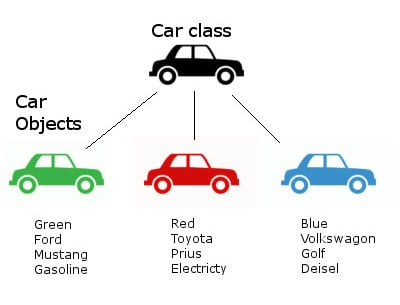
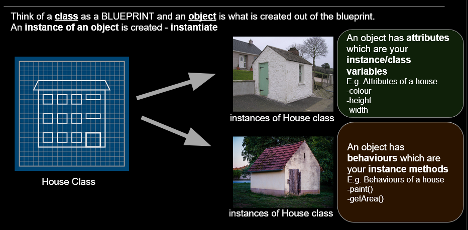

# C4.4 - OOP

## OOP in Java

*Diagram of `Car` class:*



- Note that all cars are created using the same *constructor* (initializer)
- Java classes can have many constructors
- Java classes must be created in their own separate files
	- where the class name is equal to the filename
- `void` datatype: a datatype for a function / method that returns no value

## Advantages

- **encapsulation** &mdash; carefully control how data within object is accessed / modified
- **inheritance** &mdash; create a new class "inheriting" features from parent class
- **polymorphism** &mdash; object can take on many forms
- more in-depth explanation in Unit 2: OOP

## Classes and Objects: Analogy



## Encapsulation

- `public`: keyword that defines an attribute or method to be public
	- accessible within and outside class
- `private`: defines attribute / method to be private
	- accessible only within class

### Combining Data and Methods

Fraction.java

```java
public class Fraction {
	 // attributes
	 public int num;
	 public int den;
	 
	 public Fraction (){} // constructor
	 
	 // method
	 public void numerator() {
		 System.out
	 }
}
```

Main.java

```java
public class Main {
	public static void main(String[] args) {
		Fraction f1 = new Fraction(); // instantiation
		f1.num = 2; // assigning attribute vals.
		f1.den = 1;
		f1.numerator(); // calling method
		System.out.println(f1.den);
	}
}
```

### Accessors and Mutators

- Goal of encapsulation: controlling how attributes are handled
- *Next step:* Make attributes private and make accessor / mutator methods
- Accessor naming convention: `getAttributeName()`
- Mutator naming convention: `setAttributeName()`

*Code change:*

```java
public class Fraction {
	// make attributes private
	private int num;
	private int den;
	
	public Fraction (){}
	
	// Accessors
	
	public int getNum() {
		return num;
	}
	
	public int getDen() {
		return den;
	}
	
	// Mutators
	
	public void setNum(int newNum) {
		num = newNum;
	}
	
	public void setDen(int newDen) {
		// We want to avoid division by 0
		if (newden == 0)
			den = 1; // 1 is better than 0
		else
			den = newDen;	
	}
}
```

## Constructors

- **constructor:** a special Java method that initializes all attributes for an object
	- same role as initializer in Python
- constructors **have:**
	- same name as class
	- no return

Fraction.java

```java
public class Fraction {
    private int num;
    private int den;
    
	//Constructor
	public Fraction(int initN, int initD) {
        num = initN;
        den = initD;
    }
}
```

Main.java

```java
public class Main{
  public static void main(String args[]){
    Fraction f1 = new Fraction(2,1);
  }
}
```

### Overloaded Constructor

- **overloaded constructor:** constructor that changes depending on values given
- allows multiple constructors

Fraction.java

```java
public class Fraction {
    private int num;
    private int den;
    
	public Fraction(int initN, int initD) {
        num = initN;
        den = initD;
    }
	public Fraction(int initN) {
        num = initN;
        den = 1;
    }
}
```

Main.java

```java
public class Main{
  public static void main(String args[]){
    Fraction f1 = new Fraction(2);
    Fraction f2 = new Fraction(3,4);
  }
}
```

## `toString()` method

`toString()`: a special method which only returns string representation of object

Fraction.java

```java
public class Fraction {
    private int num;
    private int den;
	
	public Fraction(int initN, int initD) {
        num = initN;
        den = initD;
    }
    public String toString() {
        return num + " / " + den;
    }
}
```

Default `toString()` output:

```
Fraction@6ff3c5b5
```

Overriden `toString()` output:

```
2 / 1
```

Main.java

```java
public class Main2{
  public static void main(String args[]){
    Fraction f1 = new Fraction(2, 1);
   
    System.out.println(f1);
    // Above auto-calls toString()
  }
}
```

## `this` Keyword

- `this` is used to reference the current object
- equivalent to Python's `self`

```java
public class Fraction {
    private int num;
    private int den;
    
    // No-Argument constructor method
    public Fraction() {
		this( 1, 1 );
		//refers to this object's other constructor
    }
    
    // Parameterized constructor method
    public Fraction( int num, int den ) {
        this.num = num;
        //this.num refers to this object's attribute
        this.den = den;
        //this.den -> this object's attribute
	}
}
```

## Reusing Mutators

Use mutators instead of assigning manually

```java
...
public Fraction (int num, int dem) {
	this.setNum(num);
	this.setDen(den);
}
```

## Static Variables & Methods + Constants

- **constant:** a variable whose value can't be changed after initialization
	- defined using `final` keyword
- **static variable:** a variable that is shared among all instances of a class
	- only one instance of static variable
	- defined using `static` keyword
- **static method:** a method that deals with static variables
	- also uses `static`

Defining static variables and methods in Fraction.java:

```java
public class Fraction {
	private int num;
	private int den;
	private final int DEFAULT_DENOMINATOR = 1; // constant
	private static int numberOfFractions = 0; // static variable

	public Fraction() {
		this.setNum(1);
    	this.setDen(DEFAULT_DENOMINATOR);
    	numberOfFractions++;
	}

	public Fraction(int initN, int initD) {
		num = initN;
		den = initD;
	   	numberOfFractions++;
    }

    public static int getNumberOfFractions() {
		// Static Method
        return numberOfFractions;
    }
	
	...
}
```

Static variables / methods in action, Main.java:

```java
public class Main{
  public static void main(String args[]){
        System.out.println("# of Fractions:" + Fraction.getNumberOfFractions());
 
        Fraction f1 = new Fraction(2, 3);
        System.out.println(f1);
        System.out.println("# of Fractions:" + f1.getNumberOfFractions());

        Fraction f2 = new Fraction();         
        System.out.println(f2);
        System.out.println("# of Fractions:" + f2.getNumberOfFractions());
  }
}
```

Output:

```
# of Fractions: 0
2 / 3
# of Fractions: 1
1 / 1
# of Fractions: 2
```

- `f1` and `f2` both share same static variable
- when one object updates it, static variable is updated for all objects