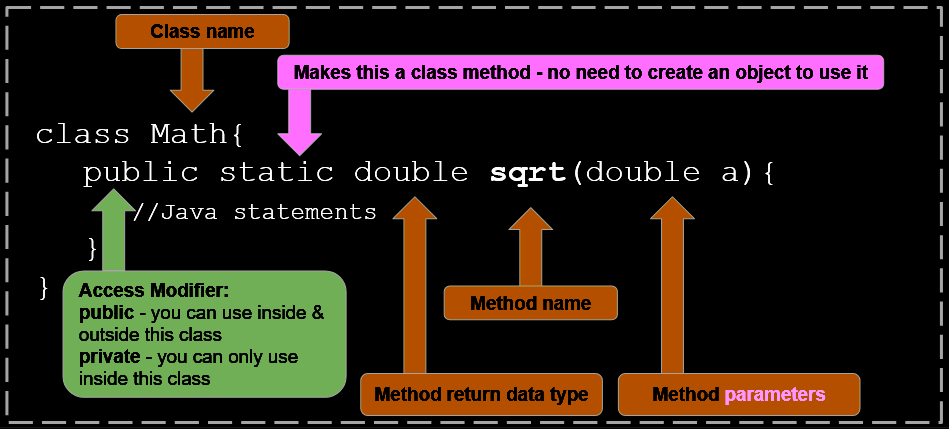
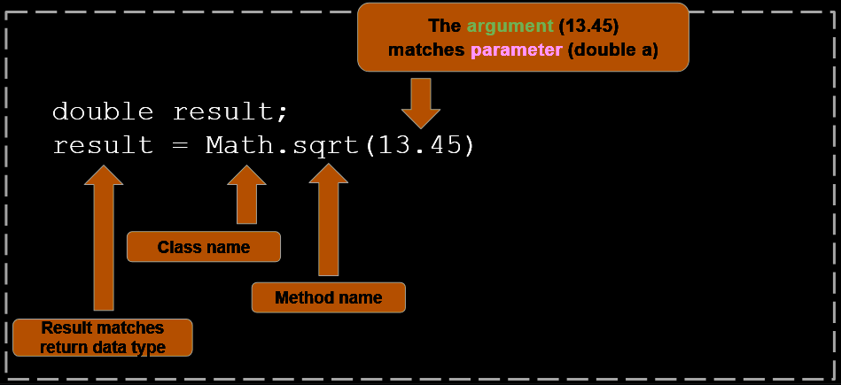
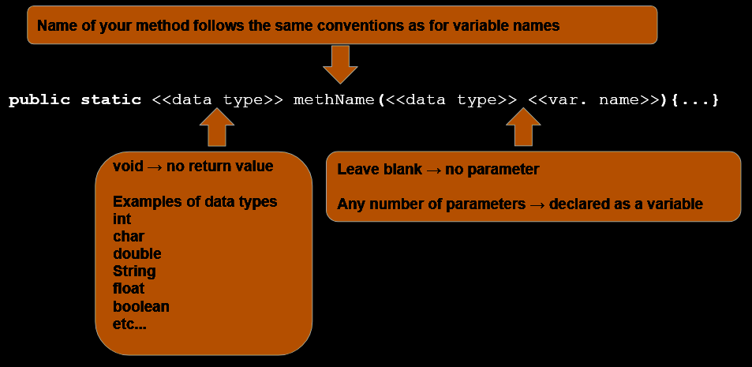
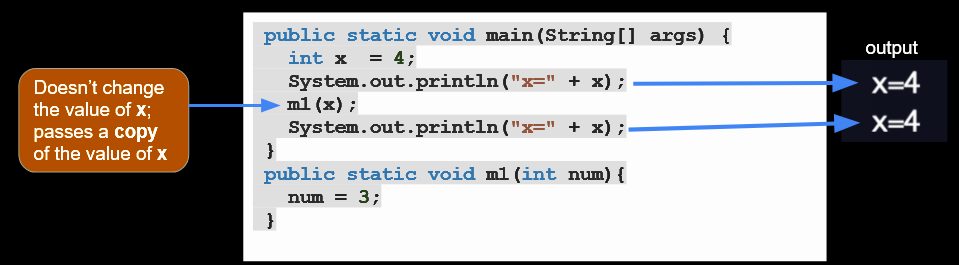
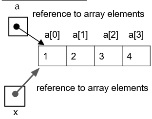
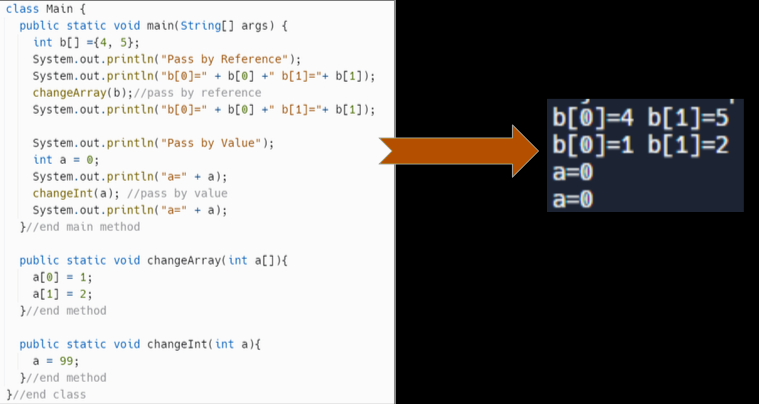
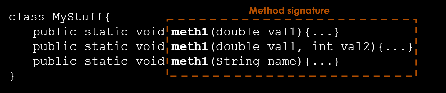
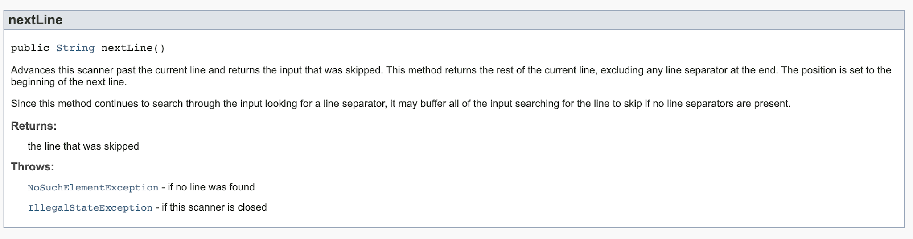

# C4.5 - Methods

## Class / Static Methods

### Why Methods?

- **code reuse:** once method is defined, its code can be called over and over again
- **clarity:** programs broken down into short, focused methods are easier to read
- **troubleshooting:** fixing bugs is easier since you can focus on method w/ bug
- **teamwork:** easier to split up work among team members when program broken down into methods

### Class/Static Methods

**class / static method:** method that do not required an instance of a class to be created to be used

*Example:*

```java
Math.round(12.34);
```

`round()` is static, no object needs to be created

*Anti-example*

```java
Scanner input = new Scanner(System.in);
int age = input.nextInt();
```

`nextInt()` is not static, instance of `Scanner` needed to be created

### Important Parts of Method Definition

1. class name
2. `static` keyword &mdash; makes a method a class method
3. **access modifier:** a keyword that determines where the method is accessible
	1. `public` &mdash; method can be used inside and outside of class
	2. `private` &mdash; method can only be used within class
4. method name
5. method return data type
6. method parameters

*Parts of a method definition, diagram:*



### Parts of Method Call

1. argument matches parameter
2. class name
3. method name
4. result matches return data type

*Method call parts, diagram:*



### Method w/ Return Type

**method w/ return ttype:** method that returns something (i.e. value, object, array) when finished running

*Format:*

```java
<<modifier>> <<static?>> <<data type>> <<methodName>>() {
	// Java code
	return <<value>>
}
```

- `void`: no return value
- `<<data type>>` can be any valid Java datatype
- `<<value>>` must match `<<data type>>`

*Examples:*

```java
class MyStuff{
	public static void method1(){...}
	public static int method2(){
		int a=0; 
		return a;
	}

	public static String[][] method3(){...}

	public static void main(String args[]){
		method1();
		int num = method2();
	String [][] word = method3();
	}
}
```

### Method w/ Parameters

**method w/ parameters:** method that takes in arguments or input (i.e. value, object, etc.) to run

*Format:*

```java
<<modifier>> <<static?>> <<data type>> <<methodName>>(<<data type>> <<var. name>>, ...) {
	...
}
```

*Focus on:*

```java
(<<data type>> <<var name>>, <<data type 2>> <<var name 2>>, ...)
```

*Examples:*

```java
class Main{
	public static void method1(int a, int b){...}
	public static void method2(double z[]){...}
	public static void method3(String y){...}

	public static void main(String args[]){
		method1(1, 2);
		double list [] = {2,3,4,5};
		method2(list);
		method3("loo");
	}
}
```

### Defining Method Parameters and Return

#### Summary



#### Example

```java
class MyStuff{
	public static void method1(double cost){...}
	public static int method2(String word, int num ){...return...}
	public static String method3(){...return...}
}

class Main{
	public static void main(String args[]){
		String greet = “hello”;
		int value = 34;
		MyStuff.method1(12.54);
		int num = MyStuff.method2(greet, value);
		String word = MyStuff.method3();
	}
}
```

---

## Scope

### Method Scope

**local scope** &mdash; variables inside a method only exist within that method

```java
class myMeth{
	public static double fun(int a){
		int x = 9 * a;
		return x;
	}
	
	public static void main(String args[]){
		double y = fun(2);
		System.out.println(x); //syntax error
		System.out.println(a); //syntax error
	}
}
```

variables `a` and `x` only exist within `fun()`

### Global / Class Variables

Create variable outside of method to create a variable shared across all methods in class

```java
class MyMethods{
	private static final int MAX = 10;
	private static int numOfPeople = 2;

	public static double updatePeople(){
		if (numOfPeople <= MAX)
		numOfPeople++;
	}
	public static void main(String args[]){
		MyMethods.updatePeople();	
		System.out.println(numOfPeople); //prints 3
	}
}
```

- `MAX` is constant because of keyword `final`
- `numOfPeople` and `MAX` exists for entire class to use

### Pass by Value - Primitive Data Types

- **pass-by-value:** when an argument is passed into a method, the value is passed in
	- *a.k.a.* pass-by-copy
- a copy of the value is created

*Pass-by-value diagram:*



1. When we pass variable `x` into the `m1` method, it passes the value of `4`
2. Inside `m1` method,
	1. Variable `num` is set to `4`.
	2. Then we change `num` to `3` 
3. When we exit the method, variable `x` is still `4`

### Pass by Reference - Arrays and Objects

- **pass-by-reference:** when a non-primitive data type is passed as an argument, the *reference value* is passed in
	- **reference value:** address in memory where value is stored
- as a consequence, the original value is changed

*Sample code:*

```java
public static void main(String[] args) {
   int a []= {1,2,3,4};
   System.out.println("a[0]=" + a[0]);
   m2(a); // <- changes value of a
   System.out.println("a[0]=" + a[0]);
}

public static void m2(int [] x){
   x[0] = 1000;
}
```

`m2(a)` passes ref. of `a` and changes it

Output:

```
a[0]=1
a[0]=1000
```

*Reference to array elements:*



1. When we pass array `a` into the `m2` method, it passes the reference to the array `a`.
2. Inside the `m2` method:
	1. Array `x` takes the reference value of `a`.  
	2. Then we change `x[0]` to `1000`.
3. When we exit the method, variable `x[0]` is now `1000`.

#### Example 2

*Example + output:*



---

## Method Overloading

### Method Overloading

- **method overloading:** having 2+ methods w/ same name but that take different parameters
	- *different method signatures*
- Methods to overload methods:
	- change no. of arguments
	- change data type
- **method signature:** the method name, parameters, and method code block

*Method signature and overloading example:*



### NO Overloading w/ Changing Return Type

- methods cannot be overloaded by just changing return type
- Java doesn't allow 2+ methods w/ same signature, but diff. return types

*Will not work:*

```java
class MyStuff{
	public static void meth1(double val1){...}
	public static String meth1(double val1){...}
	public static int meth1(double val1){...}
}
```

### Why Overload Methods?

Increases readability of program

For example,

```java
class Adder{  
	static int add(int a,int b){
		return a+b;
	}  
	static int add(int a,int b,int c){
		return a+b+c;
	}  
}  

class TestOverloading1{  
	public static void main(String[] args){  
		System.out.println(Adder.add(11,11));  
		System.out.println(Adder.add(11,11,11));  
	}
}
```

Both cases of `Adder.add` make sense; they both add

---

## Java Documentation

### About JavaDoc Comments

- Good commenting practice
- JavaDoc comments produces nicely formatted reference for IDEs / HTML docs.
	- i.e. Java API SE 8

*Formatted JavaDoc to HTML:*



### JavaDoc Comments for Classes

- `/**` starts Javadoc comment
- First line after describes class
- `@author` describes author of program
- `@version` shows version number
- `@since` shows date last modified
- Javadoc comments go above class

Format:

```java
/**
Description of class / program

@author {author name}
@version {version number}
@since YYYY-MM-DD
*/
```

Example:

```java
/**
The HelloWorld class is an application that
simply displays "Hello World!" to the standard output.

@author  Adore S.
@version 1.0
@since   2025-01-01
*/
public class HelloWorld {
   public static void main(String[] args) {
      /* Prints Hello, World! on standard output. */
      System.out.println("Hello World!");
   }
}  
```

### JavaDoc Comments for Methods

- `/**` starts Javadoc comment
- First line after describes method
- each `@param` describes a parameter
- `@return` describes return type
- Javadoc comments go above method definition

Format:

```java
/**
Descritpion of method

@param {paramName} Description of parameter
@param {paramName2} Description of parameter 2
...
@return Description of return type
*/
```

Example:

```java
/**
This method is used to add two integers. 

@param numA  This is the first number to add
@param numB  This is the second number to add
@return This returns sum of numA and numB
*/

public int addNum(int numA, int numB) {
  return numA + numB;
}
```